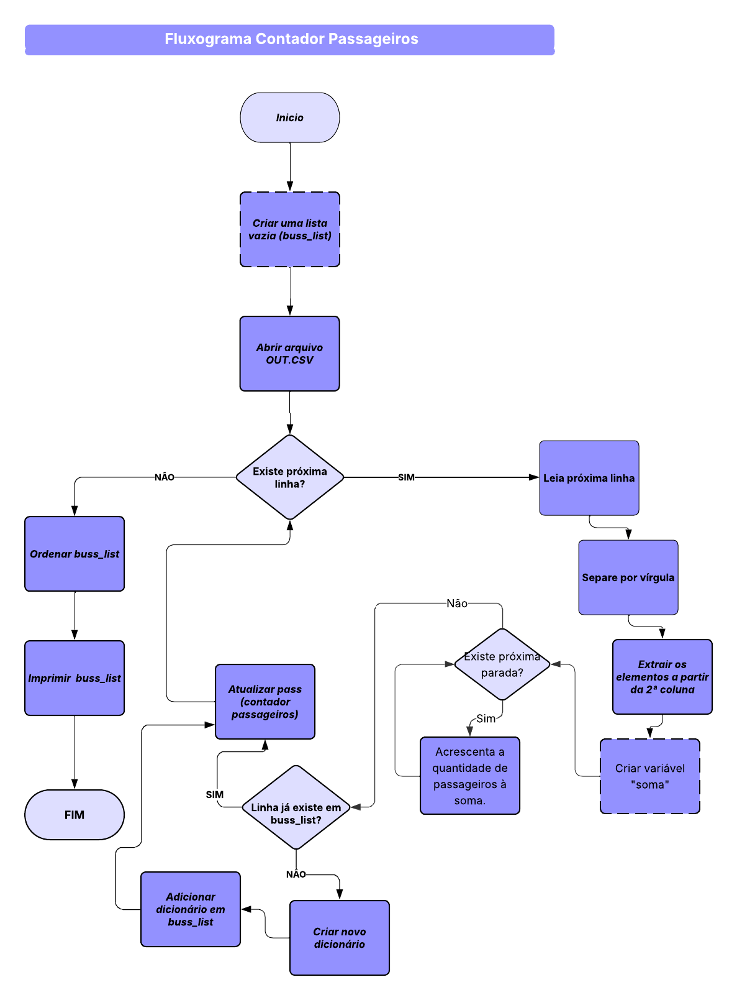

# ***Contador de Passageiros***
## 1. Justificativa
> A empresa de transporte do seu município, identificou que em horários de maior
movimento, algumas linhas estavam sobrecarregadas e por isso deseja ampliar a
quantidade de ônibus nestas linhas que têm maior volume de passageiros.
Porém, para tal, necessita de uma forma confiável, devido ao valor alto de
investimento em uma unidade de transporte, estabelecer quais linhas poderão receber
esse investimento. Com isso, é possível identificar quais linhas são mais utilizadas, auxiliando no planejamento do transporte público, na melhoria da frota e na tomada de decisões estratégicas.
## 1.1 Solução 
> Desenvolver um algoritmo que calcule a quantidade de usuários que circulam no ônibus de uma linha por viagem realizada nos horários de pico, utilizando o kit fornecido conforme contexto do problema.
## 2. fluxograma
> Fluxograma desenvolvido com Lucidchart

## 3. O Algoritmo

## 3.1 Linguagem e IDE
- Linguagem: Python
- IDE: Visual Studio Code
## 3.2 Infraestrutura necessária
- Um arquivo out.csv no mesmo diretório do script.
- Formato do arquivo CSV: linha,entrada1:saida1,entrada2:saida2,entrada3:saida3,...
## 3.3 Código Python
[Clique aqui para visualizar](https://github.com/codebyaires/contador_passageiros/blob/main/main.py)
## 3.4 Instruções de Execução
- Certifique-se de que o arquivo out.csv esteja no mesmo diretório do script Python.
- Execute o script usando: python nome_do_script.py
- O programa exibirá a lista de linhas com total de passageiros e o total geral acumulado.

## 4 Explicação do Algoritmo

O algoritmo foi desenvolvido em **Python** para processar os dados de um arquivo `CSV` contendo informações sobre as linhas de ônibus e a quantidade de passageiros registrados.  

Ele funciona em 4 etapas principais:  

1) **Leitura dos dados**  
   - O programa abre o arquivo `out.csv` e lê todas as linhas.  
   - Cada linha contém o nome da linha de ônibus e os valores correspondentes aos passageiros que entraram.  

2) **Tratamento e soma dos passageiros**  
   - Os valores são convertidos para números e somados.  
   - Se a linha de ônibus já existir na lista, o programa adiciona os novos passageiros ao total acumulado.  
   - Caso contrário, cria um novo registro para essa linha.  

3) **Organização das linhas**  
   - Todas as linhas são ordenadas em ordem decrescente, da que teve mais passageiros para a que teve menos.  

4) **Exibição dos resultados**  
   - Mostra o total de passageiros de cada linha.  
   - Calcula e exibe o **total geral de passageiros** transportados.

## 5 Desenvolvedores
>Peterson Ruivo [Linkedin](https://www.linkedin.com/in/peterson-ruivo-637345199/)

>Victor Gabriel [Linkedin](https://www.linkedin.com/in/victor-silva-93621636a/)

## 6 Apresentação
